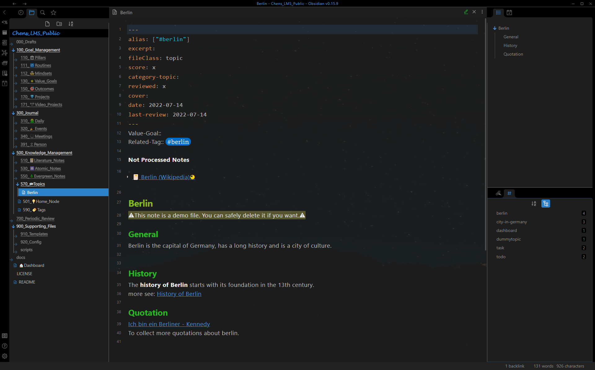

＃ 用户界面
*User Interface*

下图是 LMS 的用户界面。

从左到右有4个主要元素：

1. 工具栏
2. 左侧边栏
3. 笔记页面
4. 右侧边栏

## 工具栏
*Toolbar*

Obsidian.md 的标准工具栏。 这些工具取决于已安装的插件。

## 左侧边栏
*Left Sidebar*

左侧边栏有 4 个窗格：
- 最近的文件
- 文件管理器
- 搜索
- 已加星标
按 `Ctrl + Shit + L` 进行切换。

## 笔记页面
*Note Page*

显示笔记的主要区域。
按“F11”切换到全屏模式。

## 右侧边栏
*Right Sidebar*

右侧边栏有 4 个窗格：
- 大纲
- 日历
- 反向链接
- 标签面板
按 `Ctrl + Shit + R` 切换它。