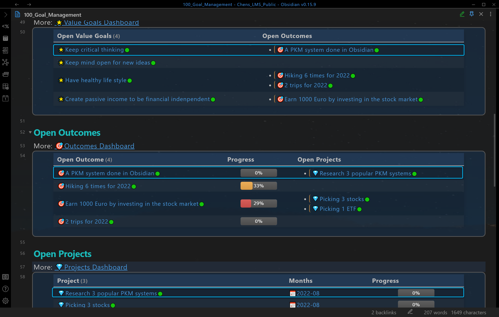

# 使用目标管理
*Use Goal Management*

通过本教程，您将学习将价值目标分解为结果，然后分解为项目。  
**支柱**：**`☯️Mental Clarity`**  
**价值目标**： **`Keep critical thinking`**  
**结果**： **`A PKM system done in Obsidian`**  
**项目**： **`Research 3 popular PKM systems`**

## 创建价值目标
*Create a value goal*

- 打开仪表板 **``100_Goal_Management``** 并按 `ALT + P` 将其固定
- 点击 **``☯️Mental Clarity``** 打开支柱笔记
- 激活笔记 **``☯️Mental Clarity``** 并按`Ctrl + Q`
- 在对话框中选择`Add a new note and add 🔗 there (Goal Management)`，然后选择`Add 🌟Value goal`
- 在下一个对话框中，输入 `Keep critical thinking`  
- **完成**：创建了一个标题为 `Keep critical thinking`  的价值目标笔记。 `Pillar::` 填写为 `☯️Mental Clarity`

## 创建结果
*Create an outcome*

- 激活笔记**``Keep critical thinking``** 并按`Ctrl + Q`
- 在对话框中选择`Add a new note and add 🔗 there (Goal Management)`，然后选择`Add 🎯Outcome`
- 在对话框中，输入`A PKM system done in Obsidian`
- **完成**：创建了一个标题为**``A PKM system done in Obsidian``** 的结果笔记。`Value Goal::` 填写为 `Keep critical thinking` 

## 创建一个项目
*Create a project*

- 激活笔记**``A PKM system done in Obsidian``** 并按 `Ctrl + Q`
- 在对话框中选择`Add a new note and add 🔗 there (Goal Management)`，然后选择`💎Project`
- 在对话框中，输入`Research 3 popular PKM systems`
- **完成**：创建了一个标题为`Research 3 popular PKM systems`的项目笔记。 `Outcome::` 填写为 `A PKM system done in Obsidian`

最后，您应该获得价值目标笔记、结果笔记和项目笔记各一个。它们显示在仪表板**``100_Goal_Management``** 中并相互链接。

