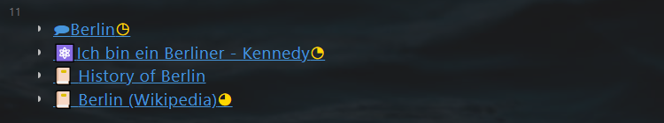
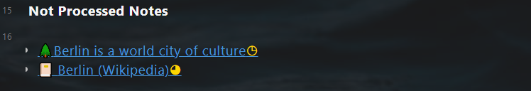

# 使用知识管理
*Use Knowledge Management*

通过本教程，您将学习从文献笔记中提取常青笔记，并将其整合到主题笔记中。  
**文献笔记**：**`Berlin (Wikipedia)`**  
**常青笔记**：**`Berlin is a world city of culture`**  
**主题笔记**：**``Berlin``**  

## 从文献笔记中生成一个常青笔记
*Generate an evergreen note from the literature note*  

- 打开文献笔记**`Berlin (Wikipedia)`**  
- 第28行和第29行已经有两个提取出来的笔记。点击第30行，使用``WIN + .``或插件输入``💡``  
- 按下`CTRL + Q`，在对话框中选择`Add a new note and add 🔗 in the current note (Journal & PKM)`，然后选择`Add 🌲Evergreen note`  
- 在下一个对话框中，输入`Berlin is a world city of culture`  
- 一个标题为`Berlin is a world city of culture`的文献笔记创建完毕并且自动打开。  
- 在第 10 行输入标签“#berlin”，所有其他带有标签“#berlin”的笔记都会自动显示。  

## 将常青笔记合并到一个主题笔记中
*Consolidate the evergreen note in a topic note*

- 打开主题笔记**``Berlin``** ，新的常青笔记**`Berlin is a world city of culture`** 显示在``Not Processed Notes``下面。  
- 在主题笔记中的任何地方，创建一个链接到**`Berlin is a world city of culture`** 。常青笔记不再显示在“Not Processed Notes”下方。  

- **完成**：再次打开常青笔记 **`Berlin is a world city of culture`** 。查看 ``link mentions`` 部分，确认该笔记是从哪个笔记中提取出来的，是在哪个笔记中被引用的.  