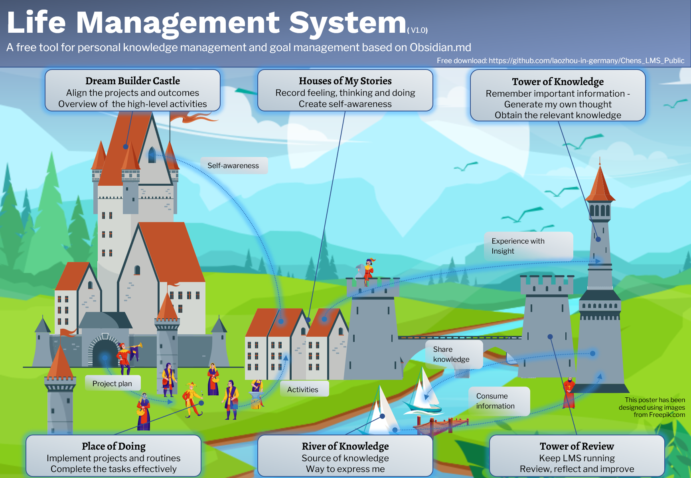

# LMS 作为中世纪小镇
*LMS as a medieval town*

LMS 是一个复杂的交互系统，如果我们把 LMS 比作一个中世纪的小镇。这个镇有6个主要区域：

- 造梦者城堡（目标管理）  
- 我的故事之家（日记）  
- 知识之塔（知识管理）  
- 回顾之塔（定期回顾）  
- 实践广场（项目实施）  
- 知识之河（外部世界）  

**造梦者城堡**是战略指挥中心。这里的指导性问题是：我想成为什么样的人？找到梦想，选择正确的东西，也许是人生中最重要的事情。愿景和梦想在这里被分解为可操作的项目。

在**实践广场**，**造梦者城堡**的项目得到实施。遵守我们的承诺并不容易。有时我们没有足够的时间，有时我们没有意志力去做一些无聊的任务，有时我们只是因为大量的任务而失去了注意力。找到适合自己的生产力方法，有效地完成任务。

生活中最困难的事情之一也许就是了解自己。写日记可以帮助你了解自己。在**我的故事之家**中，记录了感受、思考和实践。这里的指导性问题是：我是什么样的人？提高自我认识可以帮助你找到你的人生目标。将自己的经验与理论知识结合起来创造智慧。

**知识之河**是与外界交流的方式。我们消费来自外部世界的信息。在信息超载的时代，养成消费信息的好习惯是一项关键能力。我们不仅是使用知识之河的消费者，也是知识之河的参与者。我们用它来与他人交流我们的经验和意见，也分享我们的知识。

**知识之塔**是我们有效消费外部信息并创造思想的地方。不要忘记反思我们消费信息的目的：我真正需要什么样的知识（信息）？

使每个部分正常工作并保持它们之间的顺畅交互是相当复杂的。我们不妨不时退后一步，回顾和反思每个部分和整个系统。在**回顾之塔**中，我们会定期回顾它们并保持系统正常运行。

您可以下载带有每个部分工作流程的海报。 [LMS竖版海报](images/LMS_poster_portrait.png)