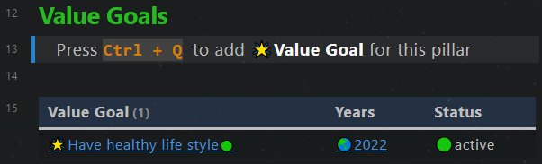
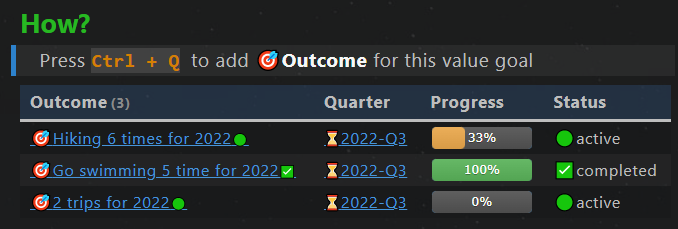
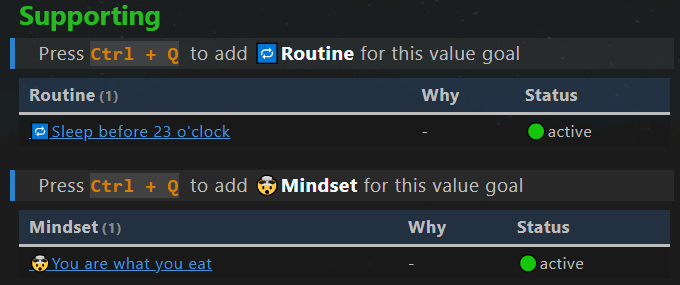

# 目标管理
*Goal Management*

## 目的
*Purpose*

**目标管理**部分旨在

- 使项目和成果与个人愿景保持一致，
- 对重要的高层活动总揽全局。

## 笔记类型
*Note types*

此目标管理使用 7 种笔记类型。

1. **🏛支柱(Pillar)**：重要的生活领域，例如财务、健康、家庭。
2. **🌟价值目标(Value Goal)**：生活领域（支柱）的目标或愿景，通常不是具体的，不是量化的，而是对我们梦想的清晰陈述。例如“我想拥有健康的生活方式”。
3. **🎯结果(Outcome)**：实现价值目标的量化可交付成果。它们必须是量化的、有时间期限的和可操作的。例如“今年去游泳10次”。确保结果真正有助于实现价值目标。
4. **💎项目(Project)**：一系列行动，用于达成结果中的里程碑。
5. **📽视频项目(Video project)**：与项目类似，但针对创建视频进行了优化。
6. **🔁习惯(Routine)**：重复的活动，以达到一定的价值目标。
7. **🤯心态(Mindset)**：实现某个价值目标所需的心态。

## 工作流程


1. 根据自我认识，定义**支柱**和**价值目标**  
2. 为价值目标推导出作为可交付**结果**  
3. 安排**项目**以实现成果  
4. 为价值目标确定所需的**习惯**和**心态**。  

输入：自我认识。  
输出：项目、习惯和心态。  


## 支柱笔记
Pillar note

### Yaml front matter 
支柱笔记中的yaml front matter具有以下标准属性。

```yaml
---
fileClass: pillar  
sorting-index: 100
category-pillar: 🟢live  
status-set2: 🟢active 
date: 2022-04-23  
---
```

`fileClass`: 笔记类型, 固定为 `pillar`    
`sorting-index`:在仪表板的dataview中，用于对支柱笔记进行排序。  
请使用以下惯例来设置排序索引。 

- 🟢live:  1xx  
- 🟠love: 2xx  
- 🔵learn: 3xx  
- 🟡legacy: 4xx   

`category-pillar`: 支柱的类别，可能的类别  [🟢live,🟠love,🔵learn,🟡legacy]  
`status-set2`: 笔记的状态，可能的状态 [🟢active,⏸on-hold,✨future,✅archived]  
`date`: 笔记的创建日期，自动创建

### value goals章节

一个dataview代码块，用于显示属于当前支柱的所有价值目标。



## 价值目标笔记
*Value goal note*

### Yalm front matter

价值目标笔记中的yaml front matter具有以下标准属性。

```yaml
---
fileClass: value-goal  
status: 🟢active
date: 2022-08-12  
---
```

`fileClass`: 笔记类型, 固定为 `value-goal`    
`status`: 笔记的状态，可能的状态 [🟢active,⏸on-hold,🔜next-up,✨future,✅completed,🗑️abandon]    
`date`: 笔记的创建日期，自动创建   

### Inline Field 章节

`Pillar::`  当前价值目标的父支柱笔记
`Years::` 当前价值目标的年份

###  How 章节

一段dataview代码块，用于显示属于当前价值目标的所有结果。 结果笔记中的任务显示为进度条。



### Supporting 章节

两个dataview代码块，用于显示支持当前价值目标的所有习惯和心态。



###  Knowledge 章节

一个dataview代码块，用于显示所有支持当前的价值目标的主题笔记（知识）。


## 结果笔记
*Outcome note*

### Yalm front matter

结果笔记中的yaml front matter具有以下标准属性。

```yaml
---
fileClass: outcome  
status: 🟢active
date: 2022-08-12  
total: 6
completed: 2
---
```

`fileClass`: 笔记类型, 固定为 `outcome`  
`status`: 笔记的状态，可能的状态 [🟢active,⏸on-hold,🔜next-up,✨future,✅completed,🗑️abandon]  
`date`: 笔记的创建日期，自动创建  
`total`: 笔记中的总任务数，由插件**MetaEdit**自动更新    
`completed`: 笔记中的已完成任务数，由插件**MetaEdit**自动更新    

###  Inline Field 章节

`Value Goal::`  当前结果笔记的父价值目标
`Quarters::` 当前结果笔记的季度

###  How 章节

dataview代码块, 用于显示属于当前结果笔记的所有项目。


## 项目笔记
*Project note*

### Yalm front matter

项目笔记中的yaml front matter具有以下标准属性。

```yaml
---
fileClass: project  
status: 🟢active
date: 2022-08-12  
total: 1
completed: 0
---
```

`fileClass`: 笔记类型, 固定为 `project`  
`status`: 笔记的状态，可能的状态 [🟢active,⏸on-hold,🔜next-up,✨future,✅completed,🗑️abandon]  
`date`: 笔记的创建日期，自动创建  
`total`: 笔记中的总任务数，由插件**MetaEdit**自动更新    
`completed`: 笔记中的已完成任务数，由插件**MetaEdit**自动更新    

### Inline Field 章节

`Outcome::`  当前项目笔记的父结果
`Months::` 当前项目笔记的月份 


## 视频项目笔记
Video project note

与项目笔记类似。


## 习惯笔记

与结果笔记类似。

## 心态笔记

与结果笔记类似。


