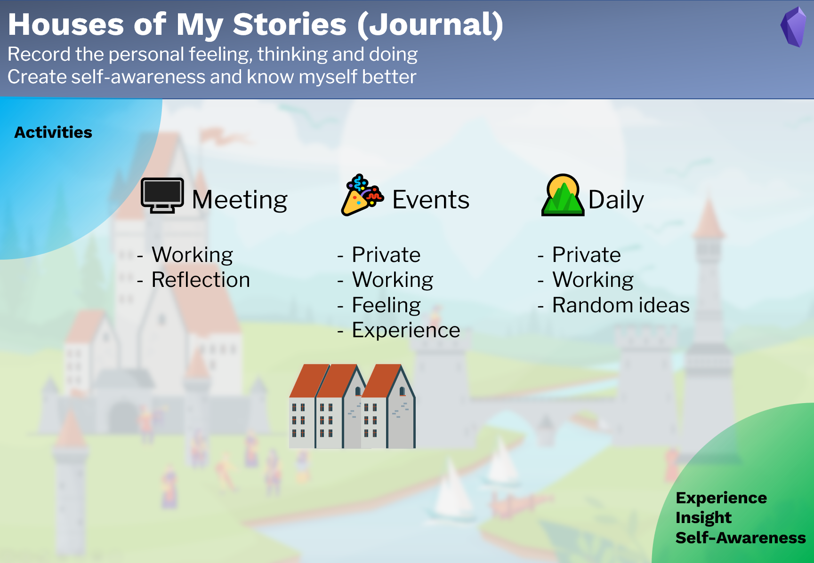

# 使用日志
*Use Journal*

## 目的
*Purpose*

**日志**部分旨在

- 记录个人的感受、思考和实践，  
- 建立自我意识，更好地了解自己。  

## 笔记类型
*Note types*

日志有 3 种笔记类型：

1. **🌄每日记录**：日常和随机日记。  
2. **🎉活动笔记**：重要活动，私人和工作活动。 例如 派对、旅行和会议。  
3. **🖥会议笔记**：会议记录。  

## 工作流程
*Workflow*

写日志是了解自己的方式之一。 用日志来记录我们的日常活动，回顾它们并反思它们。 这将增加我们的自我意识，并支持我们找到我们的梦想和人生目标。

输入：日常活动。  
输出：经验、洞察力和自我意识。  