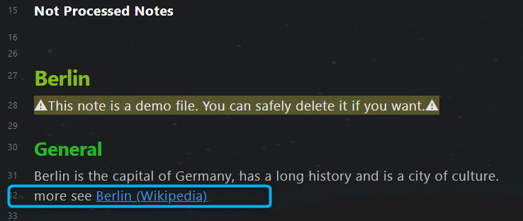

# 知识管理
*Knowledge Management*

## 目的
*Purpose*

**知识管理**部分旨在

- 记住重要信息，
- 产生我自己的想法（批判性思维），
- 获取相关知识以实现人生目标。

## 笔记类型
*Note types*

知识管理有 4 种笔记类型：

1. **📔文献笔记(Literature note)**：外部信息的记录，例如书籍、文章、推文和视频。它通常是事实、观点、故事等信息的混合体。
2. **⚛️原子笔记(Atomic note)**：一小段可重复使用的外部信息，例如，一个故事，一句格言。它们是从文献笔记中提取的，可以在我的文章里面引用。
3. **🌲常青笔记(Evergreen note)**：我的见解。它的成熟度随着我的新知识和经验而增长。它是关于某个主题的一条观点。
4. **🗩主题笔记(Topic note)**：文献笔记、原子笔记和常青笔记的集合。随着笔记数量的增加，主题的成熟度也随之提高。

## 工作流程


4 种笔记类型相互关联：

- **文献笔记**是外部信息的记录，应提炼为其他笔记类型。
- **原子笔记**摘自文献笔记，并与常青笔记相关联。
- **常青笔记** 由文献笔记生成。
- **主题笔记**是其他三种笔记类型的合并结果，他还包含了子主题笔记。所有顶级主题笔记都连接到主节点(Home Node)。

输入：来自外部的知识、自己的经验和洞察力
输出：智慧，在现实世界中正确有效的知识

## 文献笔记
*Literature note*

### Yalm front matter 
*Yalm front matter* 

文献笔记的 yaml front matter 中具有以下标准属性。

~~~yaml
---
author: Wikipedia 
excerpt: Berlin is the captical of Germany
fileClass: literature-note  
score: xxxx 
category-literature-note: article  
reviewed: xx  
cover: https://dummy.org/dummy.jpg 
date: 2022-01-13  
last-review: 2022-01-13  
---
~~~

`author`：文献作者，可选  
`excerpt`：笔记的摘录，可选  
`fileClass`：笔记类型，总是`literature-note`  
`score`：笔记分数，可能的值：x,...,xxxxx，**间隔重复**使用该属性  
`category-literature-note`：文献笔记的类别，可选  
`reviewed`: 复习次数，可能的值：x,...,xxxxx，**间隔重复**使用该属性  
`cover`：图片的https作为封面，可选，可用于使用dataview显示文献的封面。  
`date`：笔记的创建日期，自动创建  
`last-review`：最后一次回顾的日期，**间隔重复**使用该属性  


### “上下文相关重现”部分
在 yaml front matter 之后，有一个“上下文相关重现”部分。

```javascript
Tags:: #berlin
~~~dataviewjs
let tags = this.current().file.etags
let notes = tags
	.map(t => dv.pages(t + ' and !"' + this.current().file.path + '"'));
dv.list(notes.file.link);
~~~
```
`Tags::` 用于定义标签。  
您还可以在笔记的其他行中使用标签。在这里定义标签的好处是可以保持笔记结构整齐划一。

Dataview 代码块，用于重现相关笔记。  
拥有与当前笔记相同标签的所有笔记都将显示在这里，除了当前笔记本身。

### 笔记标题

笔记标题和笔记文件名保持同步，需要插件 [Filename heading sync](https://github.com/dvcrn/obsidian-filename-heading-sync).

### 正文

文献笔记的正文。

例子:

```markdown
~~~ad-summary
Berlin is the capital of Germany, has a long history and is a city of culture. 
~~~

**Berlin is the capital and largest city of Germany by both area and population**. Its 3.7 million inhabitants make it the European Union's most populous city, according to population within city limits. One of Germany's sixteen constituent states, Berlin is surrounded by the State of Brandenburg and contiguous with Potsdam, Brandenburg's capital. Berlin's urban area, which has a population of around 4.5 million, ==**is the second most populous urban area in Germany after the Ruhr.**== The Berlin-Brandenburg capital region has around 6.2 million inhabitants and is Germany's third-largest metropolitan region after the Rhine-Ruhr and Rhine-Main regions. There was an unsuccessful attempt to unify both states in 1996, and despite remaining separate, the two states cooperate on many matters to this day.
💡 [[Ich bin ein Berliner - Kennedy]]
💡 [[German cities are beautiful]]
```

在阅读模式下，以上文字将被显示为


#### 渐进式总结

建议使用 Tiago Forte 的渐进式总结来阅读文献笔记。 它是一种逐步消费信息，同时根据需要对其进行压缩的技术。 该技术包含以下步骤。

1. 原始记录
2. 用``** **`` 加粗的段落
3. 使用``== ==`` 突出显示段落
4. 使用admonition ``~~~ad-summary``进行摘要
5. 再混合

在上面的示例文本中，有两个粗体段落、一个突出显示段落和一个摘要。 为了正确显示摘要，需要插件 [Admonition](https://github.com/valentine195/obsidian-admonition)。


#### 提取原子笔记和常青笔记

在渐进式总结过程中，您应该从文献笔记中提取信息：原子笔记和常青笔记。 在示例文本中，一个原子笔记和一个常青笔记被提取出来了。 （最后两行。）

笔记标题前的符号`💡`用于标记提取。  
在阅读被提取出的笔记时，在linked mentions 部分，您可以轻松找出它是从哪个文献笔记中提取的。  例如。 原子笔记“Ich bin ein Berliner - Kennedy”是从“Berlin (Wikipedia)”中提取的，而不是从主题笔记“Berlin”中提取的。  


## 原子笔记
*Atomic note*

### Yalm front matter 

原子笔记的 yaml front matter 中具有以下标准属性。

~~~yaml
---
author: Kennedy 
excerpt: a speech by United States President John F. Kennedy 
fileClass: atomic-note  
score: xx 
category-atomic-note: aphorism  
reviewed: x 
date: 2022-07-14  
last-review: 2022-07-14  
---
~~~

`author`：文献作者，可选  
`excerpt`：笔记的摘录，可选  
`fileClass`：笔记类型，总是`atomic-note`    
`score`：笔记分数，可能的值：x,...,xxxxx，**间隔重复**使用该属性  
`category-atomic-note`：原子笔记的类别，可选  
`reviewed`: 复习次数，可能的值：x,...,xxxxx，**间隔重复**使用该属性  
`date`：笔记的创建日期，自动创建  
`last-review`：最后一次回顾的日期，**间隔重复**使用该属性  


### 标签部分 

在 yaml front matter 之后，有一个标签部分 。

```javascript
Tags:: #berlin
```

`Tags::` 用于定义标签。   
您还可以在笔记的其他行中使用标签。在这里定义标签的好处是可以保持笔记结构整齐划一。

在原子笔记中，不打算重新显示其他笔记。 所以没有像文献笔记那样类似的dataview代码块。

### 笔记标题

笔记标题和笔记文件名保持同步，需要插件 [Filename heading sync](https://github.com/dvcrn/obsidian-filename-heading-sync).

### 正文


例子:

```markdown
"Ich bin ein Berliner" ("I am a Berliner") is a speech by United States President John F. Kennedy given on June 26, 1963, in West Berlin. - [Ich bin ein Berliner - Wikipedia](https://en.wikipedia.org/wiki/Ich_bin_ein_Berliner)

```

### 反链部分

原子笔记将被其他笔记引用。 您可以在"Linked Mentions"部分中找到所有引用当前笔记的文件。


## 常青笔记
*Evergreen note*

### Yalm front matter 

常青笔记的 yaml front matter 中具有以下标准属性。

~~~yaml
---
excerpt: German cities are beautiful  
fileClass: evergreen-note
score: x  
category-evergreen-note:  
reviewed: x  
date: 2022-01-14  
last-review: 2022-01-14   
---
~~~

`excerpt`：笔记的摘录，可选  
`fileClass`：笔记类型，总是`evergreen-note`    
`score`：笔记分数，可能的值：x,...,xxxxx，**间隔重复**使用该属性  
`category-evergreen-note`：常青笔记的类别，可选  
`reviewed`: 复习次数，可能的值：x,...,xxxxx，**间隔重复**使用该属性  
`date`：笔记的创建日期，自动创建  
`last-review`：最后一次回顾的日期，**间隔重复**使用该属性  


### “上下文相关重现”部分

在 yaml front matter 之后，有一个“上下文相关重现”部分。

```javascript
Tags:: #berlin
~~~dataviewjs
let tags = this.current().file.etags
let notes = tags
	.map(t => dv.pages(t + ' and !"' + this.current().file.path + '"'));
dv.list(notes.file.link);
~~~
```

`Tags::` 用于定义标签。  
您还可以在笔记的其他行中使用标签。在这里定义标签的好处是可以保持笔记结构整齐划一。

Dataview 代码块，用于重现相关笔记。 拥有与当前笔记相同标签的所有笔记都将显示在这里，除了当前笔记本身。

### 笔记标题

笔记标题和笔记文件名保持同步，需要插件 [Filename heading sync](https://github.com/dvcrn/obsidian-filename-heading-sync).

### 正文

常青笔记的正文。


## 主题笔记
*Topic note*

### Yalm front matter 

主题笔记的 yaml front matter 中具有以下标准属性。

~~~yaml
---
alias: ["#berlin"]
excerpt:  
fileClass: topic  
score: x  
category-topic:   
reviewed: x  
cover: 
date: 2022-07-14  
last-review: 2022-07-14  
---
~~~

`alias`:笔记别名，可选  
`excerpt`：笔记的摘录，可选  
`fileClass`：笔记类型，总是`evergreen-note`    
`score`：笔记分数，可能的值：x,...,xxxxx，**间隔重复**使用该属性  
`category-topic`：主题笔记的类别，可选  
`reviewed`: 复习次数，可能的值：x,...,xxxxx，**间隔重复**使用该属性  
`date`：笔记的创建日期，自动创建  
`last-review`：最后一次回顾的日期，**间隔重复**使用该属性  


### “整合助手”部分

在yaml front matter 之后，有一个“合并助手”的部分。


```javascript
Value-Goal::  
Related-Tag:: #berlin 

**Not Processed Notes**
~~~dataviewjs
let currentPage = this.current()
let tagRel = currentPage["Related-Tag"]
let notes = dv.pages(tagRel 
			+ ' and !"' + this.current().file.path + '"' )
			.where(p => !p.file.inlinks.includes(currentPage.file.link) & p.file.etags.includes(tagRel));
if (tagRel != "#dummytopic") {
	dv.list(notes.file.link);
}
~~~
```

`Value-Goal::` 于本主题相关的价值目标   
`Tags::` 用于定义将在本主题中整合的标签  

用于支持整合的dataview代码。  
所有拥有相关标签的笔记都会显示在**Not Processed Notes**下方。但这些笔记被引用在本主题中之后(使用链接)，它们就不再显示在**Not Processed Notes**之下了。

整合之前,有一个笔记没有被整合： `Berlin (Wikipedia)`。  


整合之后， `Berlin (Wikipedia)` 不再显示。




### 笔记标题

笔记标题和笔记文件名保持同步，需要插件 [Filename heading sync](https://github.com/dvcrn/obsidian-filename-heading-sync).

### 正文

主题笔记的正文。使用链接来整合其他笔记。


