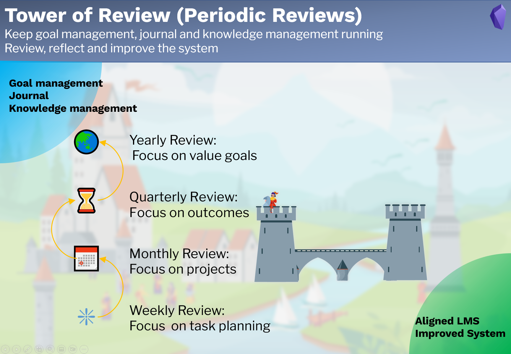

# 定期回顾
*Periodic Review*

＃＃ 目的

**定期回顾**部分旨在

- 保持**目标管理**、**日志**和**知识管理**运行，
- 回顾、反思和改进系统。

## 注释类型

定期回顾有 4 种笔记类型。

1. 每周回顾：对于周检和计划，重点在于行动的执行情况  
2. 月度回顾：月检和计划，重点在项目  
3. 季度回顾：季度回顾和计划，重点在成果  
4. 年度回顾：年审和计划，重点在价值目标  

## 工作流程

定期回顾笔记中定义了周期性重复任务：

- 清理，
- 回顾和反思每日笔记和日志，
- 回顾和反思目标管理，
- 回顾和反思知识管理，
- 回顾和反思 LMS 本身。

输入：目标管理、日志和知识管理。   
输出：一致的目标管理、日志和知识管理，以及改进后的系统。