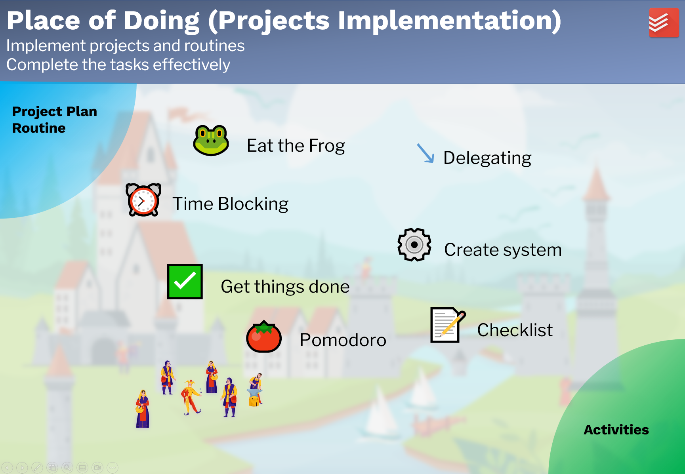

# 项目实施
*Project Implementation*

## 目的
*Purpose*

**项目实施**部分旨在

- 实施项目和习惯，
- 有效地完成任务。

## 工作流程

项目计划完成后，下一步就是项目实施。保持对自己的承诺并不容易。有时我们没有足够的时间，有时我们没有意志力去做一些无聊的工作。有时我们只是因为大量的任务而失去了焦点。为自己找到合适的生产力方法并有效地完成任务。

有很多生产力方法。一种生产力方法是否适用于某人，它取决于很多因素：个人性格、任务和方法的实施。每个人都应该找到适合他的生产力方法。以下是流行的方法：

1. Eat the frog
2. Time blocking
3. Get things done
4. 番茄钟
5. 委派
6. 创建系统
7. 任务清单

项目实施虽然是LMS的一部分，但并未在 Obsidian 中实施。其他工具可能会更好地支持它，例如Todoist。具体工具和方法的使用在此不再赘述。

输入：项目计划和所要建立的习惯。
输出：完成的任务和建立好的习惯（活动）。