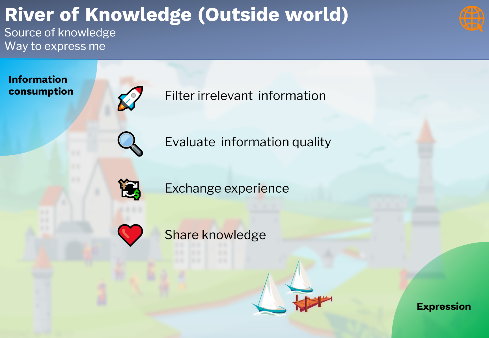

## 外部世界
*Outside World*

## 目的
*Purpose*

**外部世界**是

- 知识的来源
- 表达自己的方式。

## 工作流程
*Workflow*

来自外部世界的信息是重要的知识来源。 如今，获取信息比历史上任何时候都容易。 但这并不意味着更容易获得相关和真实的信息。 以正确的方式消费信息是一项重要的技能，包括过滤无关信息和评估信息质量......

另一方面，外界和个人之间不是一条单向道。 科技现在为每个人提供了一种向外界表达自己的方式。 我们应该利用这个机会和外界交流经验和分享知识。

重要活动：

- 过滤无关信息，  
- 评估信息质量，  
- 与社区交流经验，  
- 与外界分享知识。