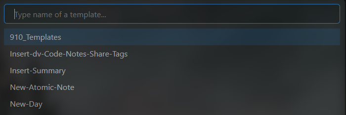
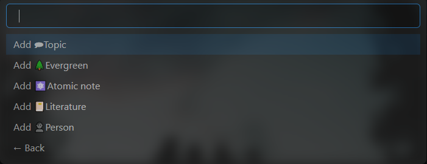

# 6种创建新笔记的方法
*6 ways to create new notes*

根据笔记类型，有多种添加新笔记的方法：

1. 使用快捷键 `Ctrl + N` 或 `New Note` 按钮
2. 使用快捷键 `Alt + N` [^1]
3. 使用快捷键 `Ctrl + Q` [^1] [^4]
4. 使用仪表盘或笔记上的按钮 [^1] [^2] [^3]
5. 右键单击笔记文件夹 [^1]
6. 单击日历面板上的日期或星期 [^3]

[^1]: 需要插件模板
[^2]: 需要插件按钮
[^3]: 需要插件日历

[^4]: 需要插件快速添加

## 使用快捷键 `Ctrl + N` 或 ``New Note`` 按钮
*Use shortcut `Ctrl + N` or ``New Note`` Button*

*使用场景：快速添加一个临时笔记，事后再定义笔记类型。*

- 通过按快捷键“Ctrl + N”或**File explorer**面板上的``New Note``按钮创建一个空笔记  
  
- 更改文件名，开始记录
- 之后：按快捷键`Alt + T` 插入模板
- 之后：将笔记移动到笔记类型的对应文件夹（例如支柱笔记存放在“110_🏛Pillars”中）

## 使用快捷键`Alt + N`
*Use shortcut `Alt + N`* 

*使用场景：为某种笔记类型快速添加笔记。*

- 通过按快捷键`Alt + N`从模板创建新笔记  
  
- 更改文件名
- 之后：根据笔记类型将笔记移动到对应的文件夹中

## 使用快捷键 `Ctrl + Q`
*Use shortcut `Ctrl + Q`*

*使用场景：为特定笔记类型快速添加笔记，同时插入链接*

- 按快捷键`Ctrl + Q`并选择笔记类型  
  
  
- 输入笔记标题  
  
  

## 使用仪表板上的按钮
*Use buttons on the dashboards*

*使用场景：为特定笔记类型添加笔记，之后无需移动笔记*

- 打开仪表板注释（例如目标管理仪表板）
- 点击它上面的按钮
- 一个新笔记被创建在对应的文件夹中
- 更改文件名  

## 右击笔记文件夹
*Right-click the note folder*

*使用场景：为特定笔记类型添加笔记，之后无需移动笔记*

- 展开左侧边栏并激活 **File explorer** 面板（如果还没有）
- 导航到笔记文件夹
- 右键单击笔记文件夹并使用上下文菜单创建一个**new note**
- 更改文件名  

## 单击日历面板上的日期或星期
*Click on the day or week on the Calendar pane*

- 展开右侧边栏并激活 **calendar** 面板（如果还没有）
- 单击日期或星期以创建新笔记  
