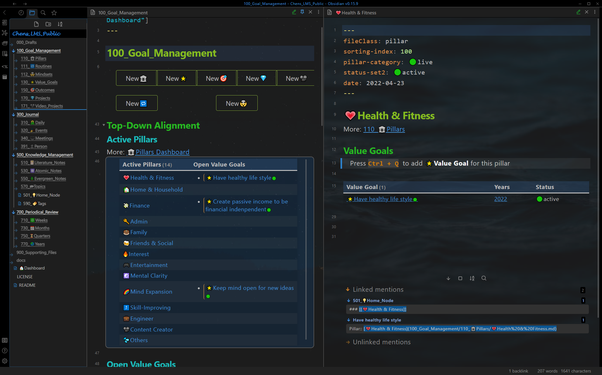
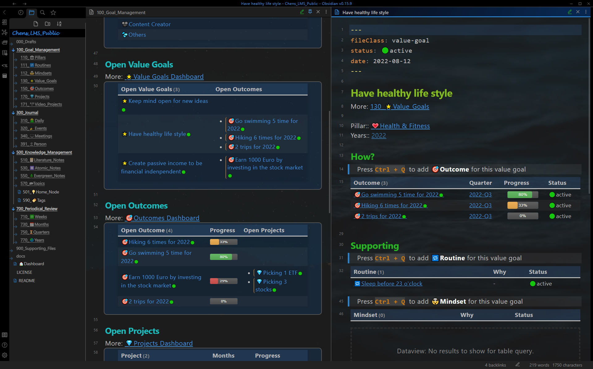
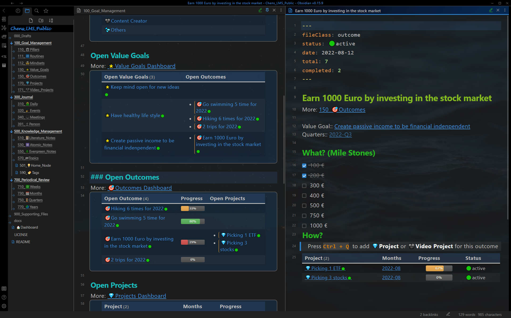
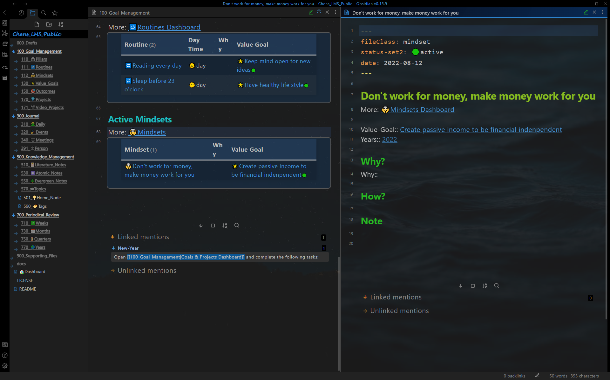
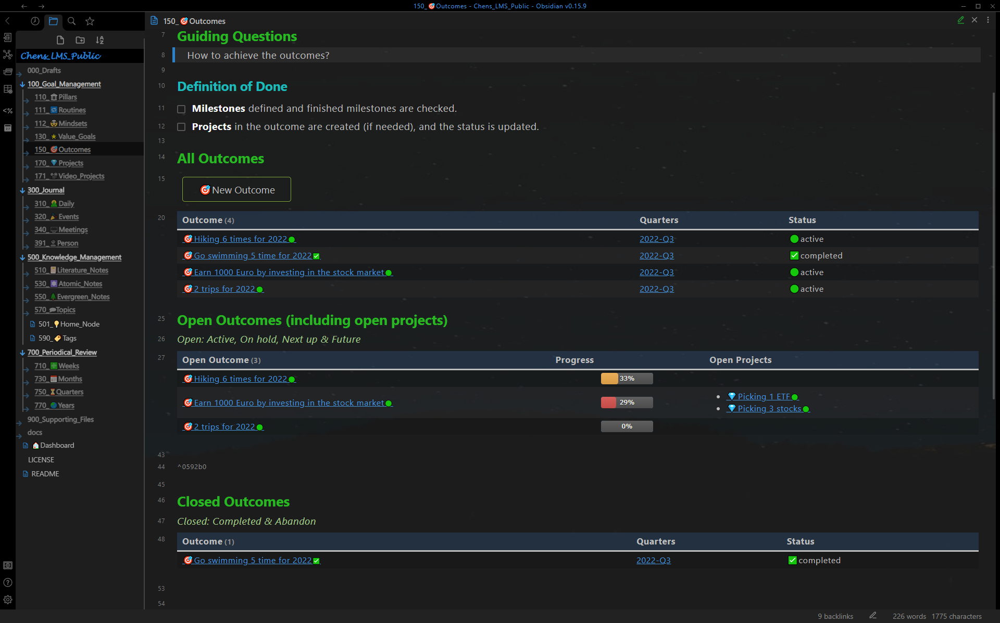

# 展示案例 - 目标管理
*Show Case - Goal management*

## 支柱
*pillar*

带有支柱笔记（右窗格）的目标管理仪表板（左窗格，固定）。
**仪表板**：所有活跃的支柱笔记都显示在此处的表格中。
**支柱笔记**：支柱的所有价值目标都显示在表格中。

## 价值目标
*Value Goal*

带有价值目标笔记（右窗格）的目标管理仪表板（左窗格，固定）。
**仪表板**：所有未完成的价值目标都显示在此处的表格中。
**价值目标笔记**：价值目标的所有结果都显示在表格中，价值目标的所有习惯和心态也显示在表格中。

## 结果
*Outcome*

带有结果笔记（右窗格）的目标管理仪表板（左窗格，固定）。
**仪表板**：所有未完成结果都显示在此处的表格中。
**结果**：结果笔记的所有项目都显示在一个表格中，每个项目都有一个进度条。

## 项目
*Project*

带有项目笔记（右窗格）的目标管理仪表板（左窗格，固定）。
**仪表板**：所有未完成项目都显示在此处的表格中。
**项目**：此处定义了任务。并自动计算完成的操作。

## 习惯
*Routine*

带有习惯笔记（右窗格）的目标管理仪表板（左窗格，固定）。
**仪表板**：所有活跃的习惯都显示在表格中。
**习惯**：习惯的目的、进度和反思都写在这里。

## 心态
*Mindset*

带有心态笔记（右窗格）的目标管理仪表板（左窗格，固定）。
**仪表板**：所有活跃的心态都显示在表格中。
**心态**：这里写了心态的目的、进步和反思。

## 单个笔记类型的仪表板

每种笔记类型提供了单独的仪表板，显示更多详细统计信息。

### 价值目标仪表板

共 3 个价值目标。它们都是未完成的的。

### 结果仪表板

一共4个结果。其中3个是未完成的，1个已完成。

