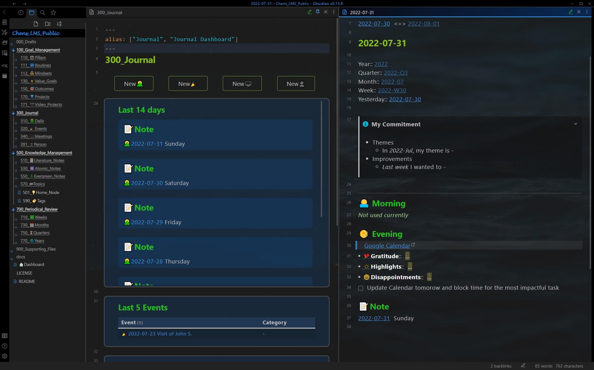
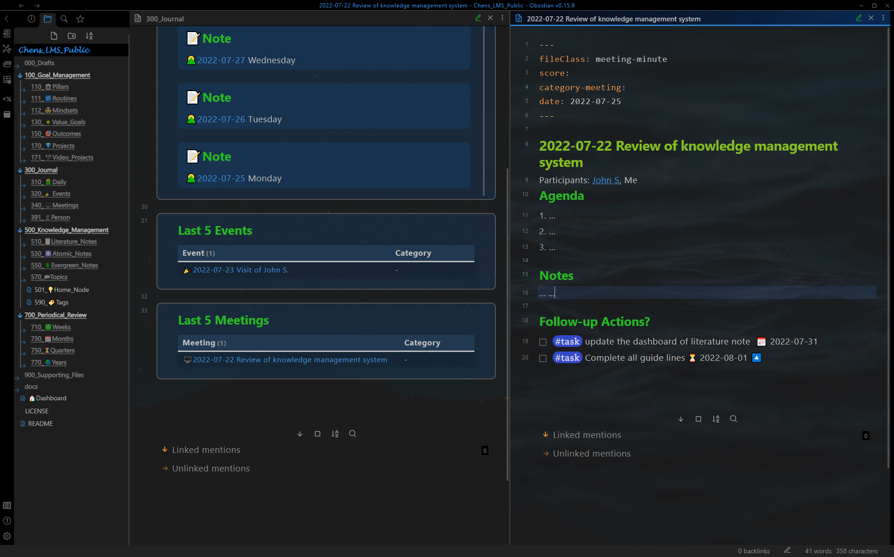

# 展示案例 -日志
*Show Case - Journal*

## 每日笔记
*Daily Note*

带有每日笔记（右窗格）的日记仪表板（左窗格，固定）。
**仪表板**：此处总结了过去 14 天的笔记。
**每日笔记**：提示本周和本月的重点、早晚的例行公事以及其他稍纵即逝的笔记。

## 事件笔记
*Event Note*

带有事件笔记（右窗格）的日志事件（左窗格，固定）。
**仪表板**：此处总结了最后 5 个事件。
**事件笔记**：记录私人和工作事件的记录。

## 会议记录
*Meeting Note*

带有会议记录（右窗格）的日记仪表板（左窗格，固定）。
**仪表板**：此处总结了最近 5 次会议。
**会议记录**：记录会议。

## 人员笔记
*Person Note*

带有人员笔记（右窗格）的人员仪表板（左窗格）。
**仪表板**：所有相关人员。
**人员笔记**：相关人员、相关事件和会议的笔记显示在linked mentions中。

