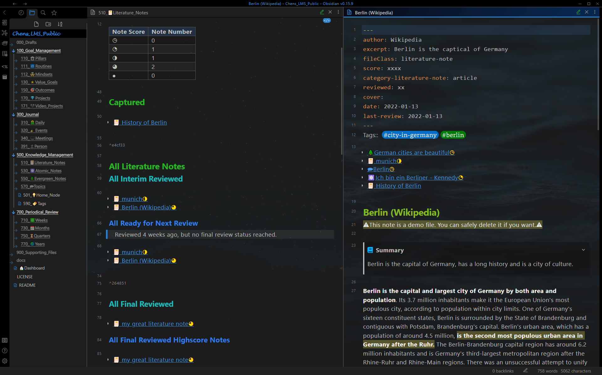

# 展示案例 - 知识管理
 *Show Case - Knowledge Management* 

## 知识管理仪表板
 *Knowledge Management Dashboard*

知识管理仪表板，带有文献笔记和用于间隔重复的常青笔记 [^1]。

知识管理仪表板，带有最终回顾的高分笔记

## 文献笔记
*Literature Note*

文献笔记仪表板（左窗格）和文献笔记（右窗格）。
**仪表板**：笔记显示在不同的章节，具体取决于回顾状态（捕获、中期回顾、最终回顾）。
**文献笔记**：Yalm front matter，所有相关笔记（上下文感知重铺 [^2]）。使用渐进式摘要处理的正文。

## 原子笔记
*Atomic Note*

带有原子笔记（右窗格）的原子笔记仪表板（左窗格）。
**仪表板**：笔记根据类别显示在不同的章节。
**Atomic note**：使用 yalm front matter，以及提及它的笔记。

## 常青笔记
*Evergreen Note*

带有常青笔记（右窗格）的常青笔记仪表板（左窗格）。
**仪表板**：笔记显示在不同的章节，具体取决于回顾状态（捕获、中期回顾、最终回顾）。
**Evergreen note**：Yalm front matter，所有相关的笔记（上下文感知重铺 [^2]）和提到它的笔记。

## 主题笔记
*Topic Note*

带有主题笔记（右窗格）的主题笔记仪表板（左窗格）。
**仪表板**：根据分数和与价值目标的关系，笔记显示在不同的部分。
**Topic note**：Yalm Front matter，所有未处理的相关笔记（合并助手[^3]）和主题摘要。

## 主节点
*Home Node*

所有顶级主题都连接到主节点，以便于导航。

## 标签
*Tag*

标签仪表板

[^1]: **间隔重复：** 笔记将在一定时间后自动显示在仪表板“510_📔Literature_Notes”/“550_🌲Evergreen_Notes”和“500_Knowledge_Management”上，具体取决于**score**、**reviewed** 和 **last-review** 在前面的问题中。

[^2]: **上下文感知重铺：**在编辑具有相同**标签**的文献笔记、常青笔记和主题笔记时，笔记将自动重铺。

[^3]: **合并助手：** 带有 **related tag** 的所有笔记都显示在 **Not Processed Note** 下面。如果它们被主题笔记引用，笔记将不再列在**Not Processed Note**下方。