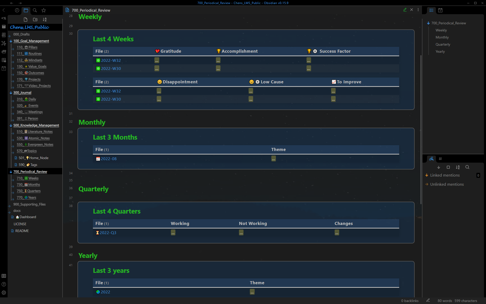
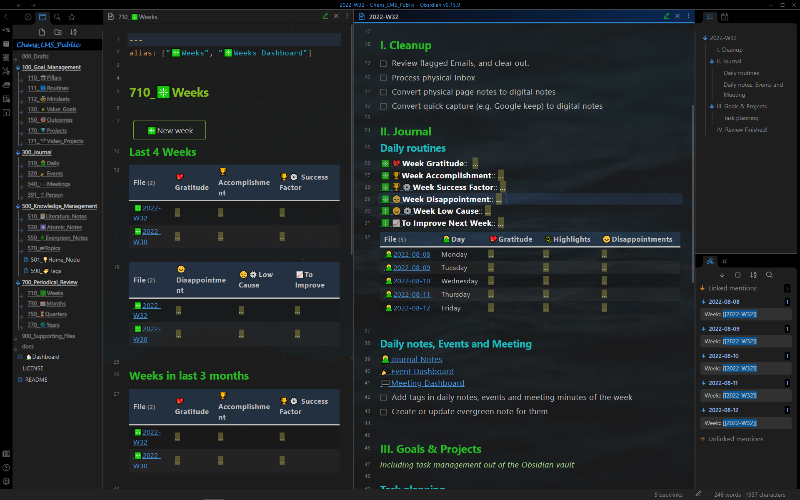
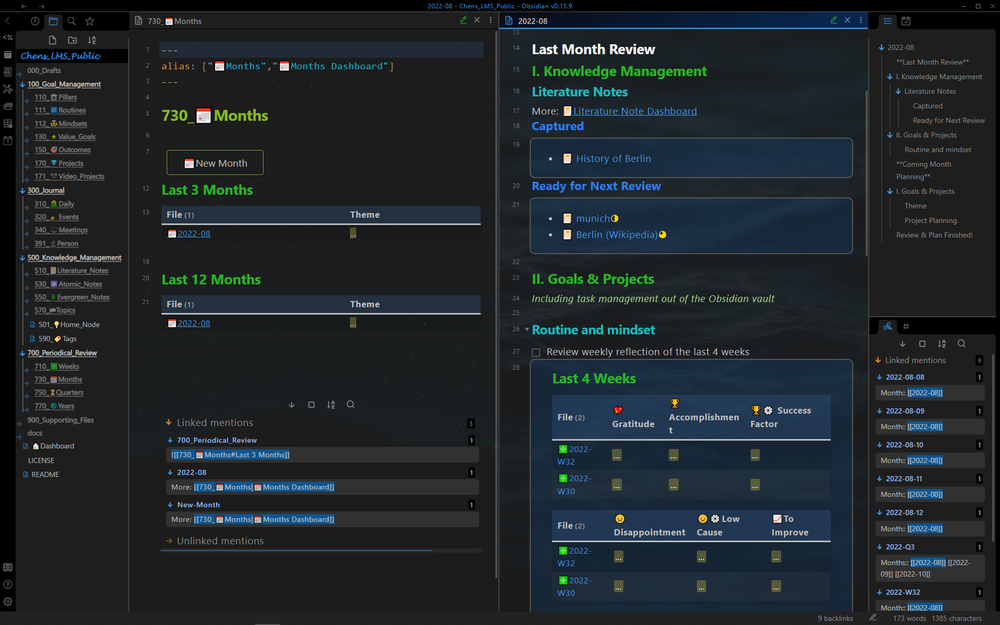

# 展示案例 - 定期回顾
*Show Case - Periodic Review*

## 定期回顾仪表板
*Periodic Review Dashboard*

所有定期回顾显示在一页上：每周回顾、每月回顾、季度回顾和年度回顾。

## 每周回顾
*Weekly review*

每周回顾仪表板（左窗格）和每周回顾注释（右窗格）。
**仪表板**：每周反思总结：感恩、成就、成功因素……
**每周回顾**：清理，一周反思，一周总结......

## 每月回顾
 *Monthly review*

月度回顾仪表板（左窗格）和月度回顾说明（右窗格）。
**仪表板**：每月主题摘要。
**每月回顾**：知识笔记的间隔重复，更新习惯和心态......

## 季度回顾
*Quarterly review* 

季度回顾仪表板（左窗格）和季度回顾说明（右窗格）。
**仪表板**：季度主题摘要。
**季度回顾**：清理，系统反思......

## 年度回顾
*Yearly review*

年度回顾仪表板（左窗格）和年度回顾注释（右窗格）。
**仪表板**：年度主题摘要。
**季度回顾**：过去一年回顾，来年规划

